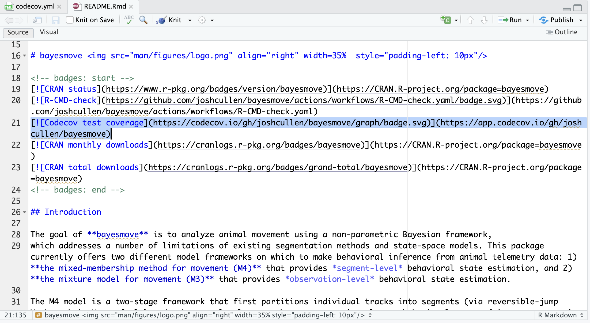

# Background

While much of these workshop materials have demonstrated how GitHub Actions can be used within workflows for scientific research (particularly for marine science), arguably the most common use is the continuous integration/continuous deployment (CI/CD) of software. This typically involves the development of software (such as functions within an R package), where changes to this code base is expected to occur over time. During this process, it's important that changes to code don't break the existing code that you or others may be using.

In this section, we will cover how GitHub Actions can be used for R package development via CI/CD as well as checks typically required for a CRAN submission. [**This section will not cover how to create an R package, but a [comprehensive e-book](https://r-pkgs.org) and [simple guide](https://docs.posit.co/ide/user/ide/guide/pkg-devel/writing-packages.html) are useful references on this topic.**]{.underline}


# Helpful functions from `usethis`

Assuming you've already created the minimal files and folders needed for a R package (e.g., `DESCRIPTION`, `NAMESPACE`, `man/`, `R/`, `data/`, `tests/`), we can leverage some helper functions from the [`usethis`](https://usethis.r-lib.org) R package to do much of the work for us when automating CI/CD and CRAN checks. This also means you should hopefully have your GitHub account configured through `usethis`; if not, refer to this [page](https://usethis.r-lib.org/articles/usethis-setup).


## `use_github_action()`

One of the most helpful purposes of using GitHub Actions for software development is to be able to perform checks on a wide range of operating systems and software versions. When R package developers want to submit to CRAN, this is a required step before the review process can move forward. By leveraging a pre-made `action` (`r-lib/actions/check-r-package@v2`) for running `R CMD Check` in the cloud on multiple operating systems with different versions of R, we can streamline this process and ensure robust software prior to release.

To do this we will use the following single line of code to set things up for us:

```{.r}
usethis::use_github_action(name = "check-standard")
```

By default, this should create a GitHub Action workflow named `R-CMD-check.yaml` that includes all the steps we should need. It should also create and add a `R-CMD-check` badge to your README file that shows it's current status after the latest run on GitHub Actions. If not, please see this [README.Rmd](https://github.com/joshcullen/bayesmove/blob/master/README.Rmd) file from the `bayesmove` package as a reference. Below is an example of what this should look like:

{#fig-check-badge-rmd}

<br>
Here is an example of the workflow file this function created to check our R package:

::: {.annot-2col}
```{.yaml filename="R-CMD-check.yaml"}
on:
  push:
    branches: [main, master]
  pull_request:

name: R-CMD-check.yaml

permissions: read-all

jobs:
  R-CMD-check:
    runs-on: ${{ matrix.config.os }}  # <1>

    name: ${{ matrix.config.os }} (${{ matrix.config.r }})  # <2>

    strategy:
      fail-fast: false
      matrix:  # <3>
        config:
          - {os: macos-latest,   r: 'release'}  # <4>
          - {os: windows-latest, r: 'release'}
          - {os: ubuntu-latest,   r: 'devel', http-user-agent: 'release'}
          - {os: ubuntu-latest,   r: 'release'}
          - {os: ubuntu-latest,   r: 'oldrel-1'}

    env:
      GITHUB_PAT: ${{ secrets.GITHUB_TOKEN }}
      R_KEEP_PKG_SOURCE: yes  # <5>

    steps:
      - uses: actions/checkout@v4

      - uses: r-lib/actions/setup-pandoc@v2

      - uses: r-lib/actions/setup-r@v2
        with:
          r-version: ${{ matrix.config.r }}  # <6>
          http-user-agent: ${{ matrix.config.http-user-agent }}
          use-public-rspm: true

      - uses: r-lib/actions/setup-r-dependencies@v2
        with:
          extra-packages: any::rcmdcheck
          needs: check

      - uses: r-lib/actions/check-r-package@v2  # <7>
        with:
          upload-snapshots: true
          build_args: 'c("--no-manual","--compact-vignettes=gs+qpdf")'
```
1. Instead of listing only a single `runner`, we can use a matrix build to use different combinations of operating systems and R versions
2. While `R-CMD-check` is the name used for the `job`, there are multiple jobs being run under this from the matrix build. Therefore, this argument provides the name for each of these based on the operating system and R version.
3. Setup to define the matrix build
4. Example showing how to specify one component of matrix build
5. An environment variable telling the `check-r-package@v2` action to use the *source* version of the package, not any binary files that might be available on CRAN
6. Listing the R version based on the matrix builds that were specified earlier
7. The `action` for running the `R CMD check` command and associated tests via GitHub Actions
:::

<br>
Once the workflow has finished running, you should see an updated `R-CMD-check` badge on your README for your GitHub repo:

{#fig-check-badge}

## `use_coverage()`

The [`use_coverage()` function](https://usethis.r-lib.org/reference/use_coverage.html) sets up the necessary files to assess the **code coverage** for your package. Code coverage is a metric that evaluates the percentage of your code base that has unit tests that check the functions written for the R package. There are many different types of unit tests that may be written to evaluate your code base, for which the [`testthat`](https://testthat.r-lib.org) R package is one of the most popular for doing so.

:::{.callout-note}
This function also allows users to specify one of two different services for running the code coverage: [Codecov](https://codecov.io) or [Coveralls](https://coveralls.io). For this demonstration, I'll cover how this works using Codecov.
:::

Once you have written some unit tests (stored in the `tests/` folder of your package directory), we can run the `use_coverage()` function to set up different parts of our directory to incorporate code coverage assessment. This includes:

- Creating a `codecov.yml` file that defines some global settings
- Adding a test coverage badge to your package `README.Rmd` file
- Prompts for updating the `README.md` file and creating a GitHub Actions workflow to automate code coverage evaluation

<br>

{#fig-codecov-yml}

<br>

{#fig-codecov-badge}

<br>
These screenshots above show how this looks in the RStudio IDE when setting up code coverage. If we also run the `usethis::use_github_action("test-coverage")` function, we can generate a GitHub Actions YAML to automate this process for us. By default, the created workflow only runs on `push` or `pull_request` (since this is when expected changes to code are made), but this can be edited as needed (such as including a `workflow_dispatch` event). However, we generally shouldn't need to change anything to this `test-coverage.yml` file (shown below). 

```{.yaml filename="test-coverage.yml"}
# Workflow derived from https://github.com/r-lib/actions/tree/v2/examples
# Need help debugging build failures? Start at https://github.com/r-lib/actions#where-to-find-help
on:
  push:
    branches: [main, master]
  pull_request:

name: test-coverage.yaml

permissions: read-all

jobs:
  test-coverage:
    runs-on: ubuntu-latest
    env:
      GITHUB_PAT: ${{ secrets.GITHUB_TOKEN }}  # <1>

    steps:
      - uses: actions/checkout@v4

      - uses: r-lib/actions/setup-r@v2
        with:
          use-public-rspm: true

      - uses: r-lib/actions/setup-r-dependencies@v2
        with:
          extra-packages: any::covr, any::xml2
          needs: coverage

      - name: Test coverage
        run: |
          cov <- covr::package_coverage(
            quiet = FALSE,
            clean = FALSE,
            install_path = file.path(normalizePath(Sys.getenv("RUNNER_TEMP"), winslash = "/"), "package")
          )
          print(cov)
          covr::to_cobertura(cov)
        shell: Rscript {0}

      - uses: codecov/codecov-action@v5
        with:
          # Fail if error if not on PR, or if on PR and token is given
          fail_ci_if_error: ${{ github.event_name != 'pull_request' || secrets.CODECOV_TOKEN }}
          files: ./cobertura.xml
          plugins: noop
          disable_search: true
          token: ${{ secrets.CODECOV_TOKEN }}  # <2>

      - name: Show testthat output
        if: always()
        run: |
          ## --------------------------------------------------------------------
          find '${{ runner.temp }}/package' -name 'testthat.Rout*' -exec cat '{}' \; || true
        shell: bash

      - name: Upload test results
        if: failure()
        uses: actions/upload-artifact@v4
        with:
          name: coverage-test-failures
          path: ${{ runner.temp }}/package
```
1. Needs GitHub PAT from your account
2. Needs Codecov token created for your account on <https://codecov.io>

<br>
As is shown in the `test-coverage.yml` file, a token from your account on Codecov (associated with your GitHub repo) is needed. More information on creating this token can be found from this [Quick Start guide](https://docs.codecov.com/docs/quick-start) and this [tutorial for GitHub integration](https://docs.codecov.com/docs/github-2-getting-a-codecov-account-and-uploading-coverage).

Now that we have the GitHub Actions workflow file created and our tokens made available as *secrets*, we can `push` some changes to the package directory and test it out. For example, screenshots are shown below of what the live log looks like while the code coverage tests are being run, as well as what the results look like on the Codecov website for your repo.

<br>

{#fig-codecov-log}

<br>

{#fig-codecov-results}

With automated code coverage in place, you and the users of your R package have a better sense of the quality assurance of your code with respect to unit testing across the different functions you've written. While useful, this step isn't necessary to prepare an R package for submission to CRAN or for wider use and installation from GitHub.


# Takeaways

With these CI/CD workflows for R package development, we can now more robustly test R packages prior to a new release or a CRAN submission. This includes running a standard check of the R package, as well as evaluating code coverage based on the unit tests written for the included functions of the package. If desired, developers can adjust these auto-generated YAML files for each workflow to suit their needs. While not covered here, there are other options for GitHub Actions workflows that can be generated from the `use_github_actions()` function, such as the automated building and deployment of a `pkgdown` website associated with the R package (such as for [`bayesmove`](https://joshcullen.github.io/bayesmove/)).