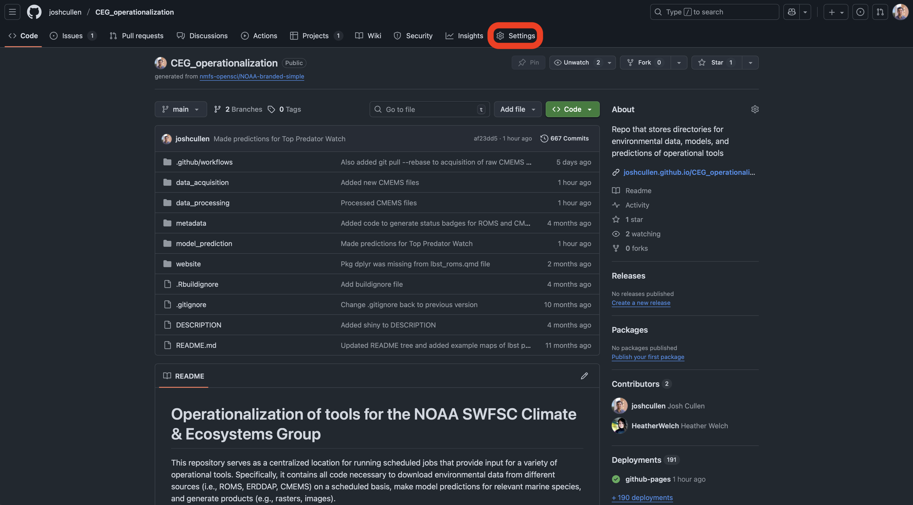
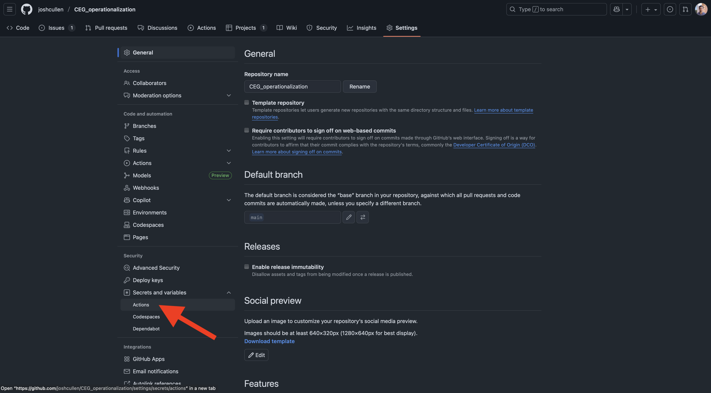
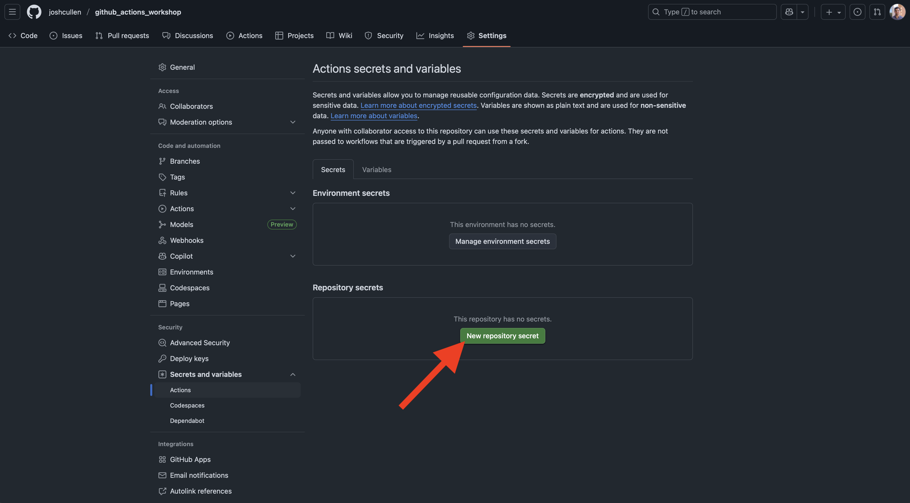
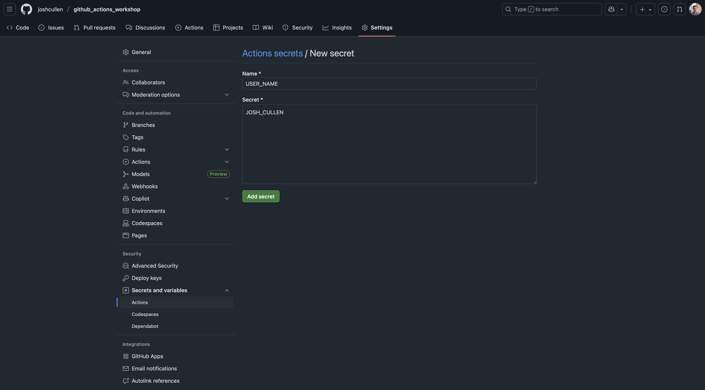
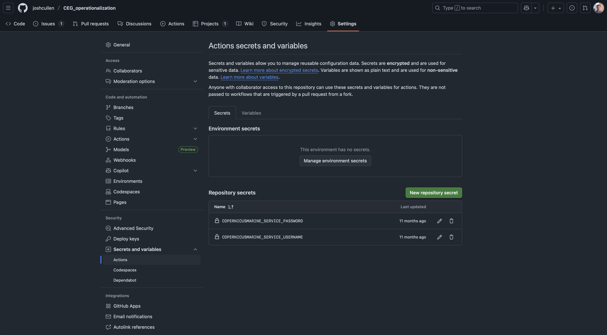
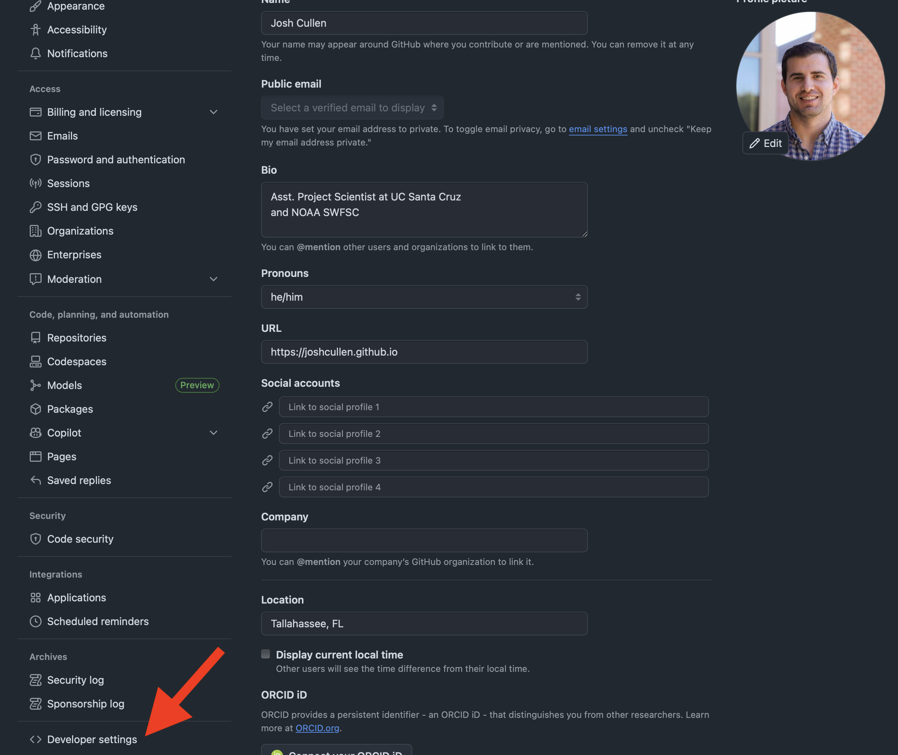
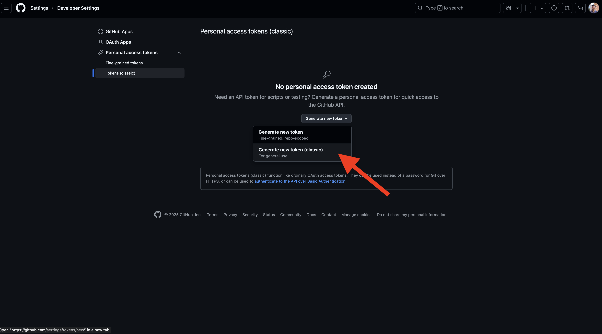
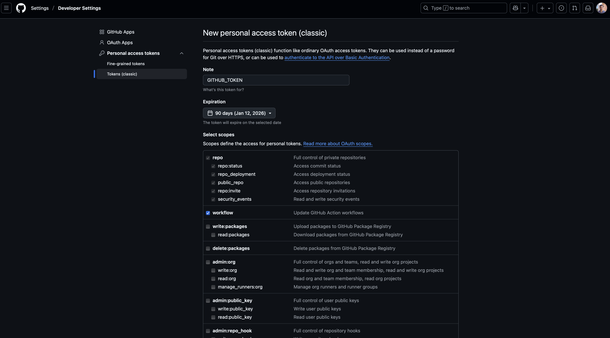
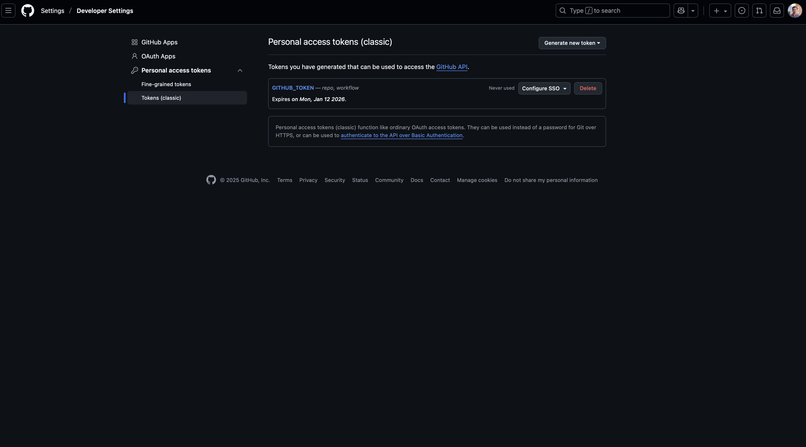

# Background

Building upon the [Simple GitHub Actions](../Simple_GHAs/index.qmd) topics, we can now start adding more pieces to our workflows, such as running scripts in R, Python, or MATLAB. Since the purpose and components of scripts can be highly varied, I'll only cover a few examples here in each programming language. Depending on your needs and your entire analysis workflow, you may be able to accomplish all steps in a single scripts, or may need multiple scripts across multiple jobs and even workflows.

This section will also introduce the use of "*secrets*" when applying tokens or log-in credentials that are needed within workflows, which ensures a more secure working environment without these tokens or credentials hard-coded into the workflow YAML. But for now, let's get started on covering how to run custom scripts to perform tasks and analyses.


# Run scripts

While we've already covered how to set up a virtual machine (VM) to run R scripts, we have yet to cover how to run your code. This process is quite simple and represents only a small extension beyond the work to set up the VM. Below is an example showing how to run scripts stored in your repo:

::: {.panel-tabset group="language"}
## R
```{.yaml filename="complex_r_script.yml"}
name: Run R script

on:
  workflow_dispatch:

jobs:  
  run_r: 
    runs-on: ubuntu-latest
    steps:  
    - name: Check out repository  
      uses: actions/checkout@v5  

    - name: Install R
      uses: r-lib/actions/setup-r@v2  
    
    - name: Install R packages
      uses: r-lib/actions/setup-r-dependencies@v2
      with:
        cache: always
        extra-packages: |
          ropensci/rnaturalearthhires  #install package from GitHub
      
    - name: Download and export SST
      shell: Rscript {0}  # <1>
      run: source("Complex_GHAs/src/download_export_sst.R")  # <2>
```
1. Need to specify the R shell to run R code
2. Use `source()` function to 'source' (i.e., run) the R script listed. **Need to make sure to specify the full file path from the root directory in quotes**

<br>
If we wanted to run multiple R scripts at a time, we could either run them in the same `step`, or as different steps. The example below demonstrates how to run two scripts within a single `step`:

```{.yaml filename="complex_r_script2.yml"}
name: Run R script

on:
  workflow_dispatch:

jobs:  
  run_r: 
    runs-on: ubuntu-latest
    steps:  
    - name: Check out repository  
      uses: actions/checkout@v5  

    - name: Install R
      uses: r-lib/actions/setup-r@v2  
    
    - name: Install R packages
      uses: r-lib/actions/setup-r-dependencies@v2
      with:
        cache: always
        extra-packages: |
          ropensci/rnaturalearthhires  #install package from GitHub
      
    - name: Download and export SST
      shell: Rscript {0}
      run: |
        source("Complex_GHAs/src/download_export_sst.R")
        source("Complex_GHAs/src/summarize_sst.R")
```


## Python
```{.yaml filename="complex_python_script.yml"}
name: Run Python script
on:
  workflow_dispatch:

jobs:  
  run_python: 
    runs-on: ubuntu-latest
    steps:  
    - name: Check out repository  
      uses: actions/checkout@v5  

    - name: Install Conda
      uses: conda-incubator/setup-miniconda@v3
      with:
        auto-update-conda: true
        python-version: 3.12
    
    - name: Install Python packages
      run: pip install -r requirements.txt
    
    - name: Download and export SST
      run: python Complex_GHAs/src/download_export_sst.py  # <1>
```
1. Use this command to run a Python script from shell. **Make sure you specify the full file path with respect to the root directory.**

<br>
If we wanted to run multiple Python scripts at a time, we could either run them in the same `step`, or as different steps. The example below demonstrates how to run two scripts within a single `step`:
```{.yaml filename="complex_python_script2.yml"}
name: Run Python script
on:
  workflow_dispatch:

jobs:  
  run_python: 
    runs-on: ubuntu-latest
    steps:  
    - name: Check out repository  
      uses: actions/checkout@v5  

    - name: Install Conda
      uses: conda-incubator/setup-miniconda@v3
      with:
        auto-update-conda: true
        channels: conda-forge,defaults
        python-version: 3.12
    
    - name: Install Python packages
      run: pip install -r requirements.txt
    
    - name: Download and summarize SST
      run: |
        python Complex_GHAs/src/download_export_sst.py
        python Complex_GHAs/src/summarize_sst.py
```

## MATLAB
```{.yaml filename="complex_matlab_script.yml"}
name: Run MATLAB script
on:
  workflow_dispatch:

jobs:  
  run_matlab: 
    runs-on: ubuntu-latest
    steps:  
    - name: Check out repository  
      uses: actions/checkout@v5  

    - name: Set up MATLAB
      uses: matlab-actions/setup-matlab@v2
      with:
        release: R2024a
    
    - name: Download and export SST
      uses: matlab-actions/run-command@v2  # <1>
      with:
        command: addpath("Complex_GHAs/src"), download_export_sst  # <2>
```
1. Need to use an `action` to run MATLAB code (since uses proprietary software via license)
2. There are a [couple ways](https://github.com/matlab-actions/run-command/) that MATLAB scripts can be run using GitHub Actions. This example shows one way to run a script that is stored in a directory different from the root (i.e., directory named `Complex_GHAs/src`). **Make sure to leave the file extension (`.m`) off of the provided script name.**

<br>
If we wanted to run multiple MATLAB scripts at a time, we could either run them in the same `step`, or as different steps. The example below demonstrates how to run two scripts within a single `step`:

```{.yaml filename="complex_matlab_script2.yml"}
name: Run MATLAB script
on:
  workflow_dispatch:

jobs:  
  run_matlab: 
    runs-on: ubuntu-latest
    steps:  
    - name: Check out repository  
      uses: actions/checkout@v5  

    - name: Set up MATLAB
      uses: matlab-actions/setup-matlab@v2

    - name: Download and export SST
      uses: matlab-actions/run-command@v2
      with:
        command: addpath("Complex_GHAs/src"), download_export_sst, summarize_sst
```
:::


# Use secrets and tokens

While running scripts, users may wish to connect to a database, use and API, or push files to their own GitHub repository. Each of these applications often requires authorization of some kind through your own account credentials. These credentials and other sensitive information associated with your GitHub account or organization are called "[*secrets*](https://docs.github.com/en/enterprise-cloud@latest/actions/concepts/security/secrets)". These *secrets* can only be read if explictly included in a GitHub Actions workflow and are encrypted, which helps minimize security risks. Similarly, a personal access token (PAT) is often required to authorize your GitHub account during normal activities (e.g., pushing to repo, installing R package from GitHub). This PAT can then be used within the `GITHUB_TOKEN` secret during a GitHub Action workflow to authorize changes to your repo (such as pushing newly created files).

## Secrets

### Create a secret
To use *secrets* in your workflow, you first need to define these on the webpage for your GitHub repo. 

{#fig-repo-landing}

<br>
After clicking on the " Settings" tab for your repo, you'll then navigate to the "Secrets and variables" dropdown in the sidebar and choose "Actions".

{#fig-gh-repo-settings}

<br>
While on this page, you should not see any *secrets* currently stored for this repo. To add some, we'll click on the green "New repository secret" button.

{#fig-gh-empty-secrets}

<br>
Next, we'll enter the name and value associated with the *secret* we'd like to store. For example, you could store the username for an account or API as shown below:

{#fig-add-secret}

<br>
Once you've added your *secrets* to the repo, they should show up like this:

{#fig-cmems-secrets}

### Use secrets in a workflow

With these *secrets* now added for the repository, we can now use them within our workflow YAML files. To demonstrate this, below is an example showing how to access data from Copernicus Marine Environmental Monitoring Service (CMEMS) for mixed layer depth:

::: {.annot-2col}
```{.yaml filename="use_cmems_secrets.yml"}
name: Access CMEMS data
on:
  workflow_dispatch:

jobs:  
  download_cmems:
    runs-on: ubuntu-latest
    steps:  
    - name: Check out repository
      uses: actions/checkout@v5 

    - name: Install Conda
      uses: conda-incubator/setup-miniconda@v3
      with:
        auto-update-conda: true
        channels: conda-forge,defaults
        python-version: 3.12

    - name: Install Copernicus Marine Toolbox
      shell: bash -el {0}
      run: |
        conda install -c conda-forge copernicusmarine  # <1>
        conda install scipy  # <2>

    - name: Install R
      uses: r-lib/actions/setup-r@v2

    - name: Install R packages
      uses: r-lib/actions/setup-r-dependencies@v2
      with:
        cache: always
        packages:
          any::glue

    - name: Download CMEMS data
      env:  # <3>
        COPERNICUSMARINE_SERVICE_USERNAME: ${{ secrets.COPERNICUSMARINE_SERVICE_USERNAME }}  # <4>
        COPERNICUSMARINE_SERVICE_PASSWORD: ${{ secrets.COPERNICUSMARINE_SERVICE_PASSWORD }}  # <5>
      shell: Rscript {0}
      run: |
        source("Complex_GHAs/src/acquire_cmems.R")  # <6>
```
1. Install `copernicusmarine` on VM
2. Also need to install `scipy` dependency for `copernicusmarine` since not already installed
3. The `env` argument let's you specify different environment variables for this `step`; alternatively can be specified at higher level for entire `job`.
4. The environment variable defined for the username applied when accessing the `copernicusmarine` API, where `secrets.COPERNICUSMARINE_SERVICE_USERNAME` refers to the username stored previously.
5. The environment variable defined for the password applied when accessing the `copernicusmarine` API, where `secrets.COPERNICUSMARINE_SERVICE_PASSWORD` refers to the password stored previously.
6. The R script running code to download CMEMS data
:::

<br>
The [acquire_cmems.R](https://github.com/joshcullen/github_actions_workshop/blob/main/Complex_GHAs/src/acquire_cmems.R) script and GitHub Actions [workflow log](https://github.com/joshcullen/github_actions_workshop/actions/runs/18508624602/job/52743794408) provide more information on how this was run. Alternatively, the recent [CopernicusMarine](https://pepijn-devries.github.io/CopernicusMarine/) R package is currently under active development, but may provide a more user-friendly method of accessing CMEMS data than the example shown here. Instead of the command line interface (CLI) syntax used in this script, Python users may wish to use the `copernicusmarine` [Python interface](https://toolbox-docs.marine.copernicus.eu/en/stable/python-interface.html).


## Tokens

### Create a PAT
If you have not previously created a personal access token (PAT) for your GitHub workflows, we'll briefly walk through how to do that below. To navigate to the correct page, you'll need to click on your photo/avatar in the topright corner of the [GitHub website](https://www.github.com) while logged in and then select " [Settings](https://github.com/settings/profile)" from the dropdown menu. From this next page, you'll select the "[Developer settings](https://github.com/settings/apps)" link at the very bottom of the sidebar.

{#fig-dev-settings}

<br>
Finally, you'll click on the "Personal access tokens" dropdown option from the sidebar and then select "[Tokens (classic)](https://github.com/settings/tokens)". On this page, you may see that no PAT exists (as shown below). If so, you'll click on the "Generate new token" button and then select the "classic" option (unless you prefer to create a fine-grained token at this time).

{#fig-create-pat}

<br>
After doing this, we now need to define the scope of this token, which specifies the permissions that are allowed with these credentials. While all you should need for the examples demonstrated in this workshop are the **repo** and **workflow** options, you may wish to select more than these two. Additionally, you'll need to give your token a name (such as the generic `GITHUB_TOKEN` used here) and select an expiration date. Once your token expires, you will need to generate a new one that will provide sustained acces to your repo. It is generally recommended to use a defined expiration period, but the option "No expiration" is available as well.

{#fig-pat-scope}

<br>
Once you chosen the scope of the PAT, scroll down to the bottom of the page and click the green "Generate token" button. You'll then be brought to a page that shows your generated PAT. You need to copy and store this token somewhere safe if wanting to use it in other environments (such as RStudio, Positron, VS Code, etc) because it will not be visible again once you leave this page. If you refresh or revisit this page, you'll only see that the PAT exists and the expiration date. If needed, you can always delete and generate a new token.

{#fig-new-token}


### Use PAT to `push` files to repo

Now that we have a token stored for our GitHub account, we can now modify our repo from a GitHub Actions workflow. This may be particularly useful for cases such as adding new files generated during a workflow that are importance, updating a website hosted via GitHub Pages, performing CI/CD tasks for software development, and much more. To expand on previous demonstrations of workflows, the below example shows how to download environmental data from ERDDAP and then `push` a netCDF file to a repo.

::: {.annot-2col}
```{.yaml filename="use_pat.yml"}
name: Download and push ERDDAP data
on:
  workflow_dispatch:

jobs:  
  run_python: 
    runs-on: ubuntu-latest
    permissions:  # <1>
      contents: write  # <2>
    env:  # <3>
      GITHUB_PAT: ${{ secrets.GITHUB_TOKEN }}  # <4>
    steps:  
    - name: Check out repository  
      uses: actions/checkout@v5  

    - name: Install Conda
      uses: conda-incubator/setup-miniconda@v3
      with:
        auto-update-conda: true
        python-version: 3.12
    
    - name: Install Python packages
      run: pip install -r requirements.txt
    
    - name: Download and export SST
      run: python Complex_GHAs/src/download_export_sst2.py
    
    - name: Commit and Push Changes
      run: |
        git config --global user.name "${{ github.actor }}"  # <5>
        git config --global user.email "${{ github.actor }}@users.noreply.github.com"  # <6>

        git add .  # <7>
        git commit -m 'Added new ERDDAP SST file'  # <8>
        git push  # <9>
```
1. The `permissions` argument may need to be specified for the workflow in order to allow users to modify the repo (such as by committing and pushing files)
2. Under `permission`, we need to specify that we need to be able to `write` files to the repo. Otherwise, in this particular case, the workflow will fail.
3. The `env` argument here specifies environment variables defined for the entire workflow, including use of tokens or *secrets*
4. Assigning the PAT I generated (named `GITHUB_TOKEN`) to environment variable named `GITHUB_PAT`. By default, GitHub Actions is able to auto-detect a PAT that you've created without explictly specifying it, but it is good practice to do so.
5. Defining the `user.name` associated with the account committing and pushing this file. There are a number of ways you can specify this, but the `github.actor` variable uses the username associated with your account.
6. Defining the `user.email` associated with the account committing and pushing this file. There are a number of ways you can specify this, but the `github.actor` variable uses the email associated with your account.
7. The Git syntax to `add` (or stage) all new or modified files in the repo. It's also possible to specify a certain directory, filetype, and specific file if preferable.
8. The Git syntax to `commit` files, as well as providing a message associated with this `commit`.
9. The Git syntax to `push` the `commit` to the remote repo location (i.e., on GitHub).
:::


# Takeaways

In this section, we covered the last major pieces to construct a complete GitHub Actions workflow that goes from VM setup to running scripts and pushing these resulting files to your repo. These components likely cover a wide range of standard use cases of GitHub Actions in scientific research. However, there may be other use cases of interest or more advanced topics that have not been covered so far (such as running multiple jobs in a single workflow, or performing R package checks and tests for CI/CD) but will be introduced in subsequent sections.