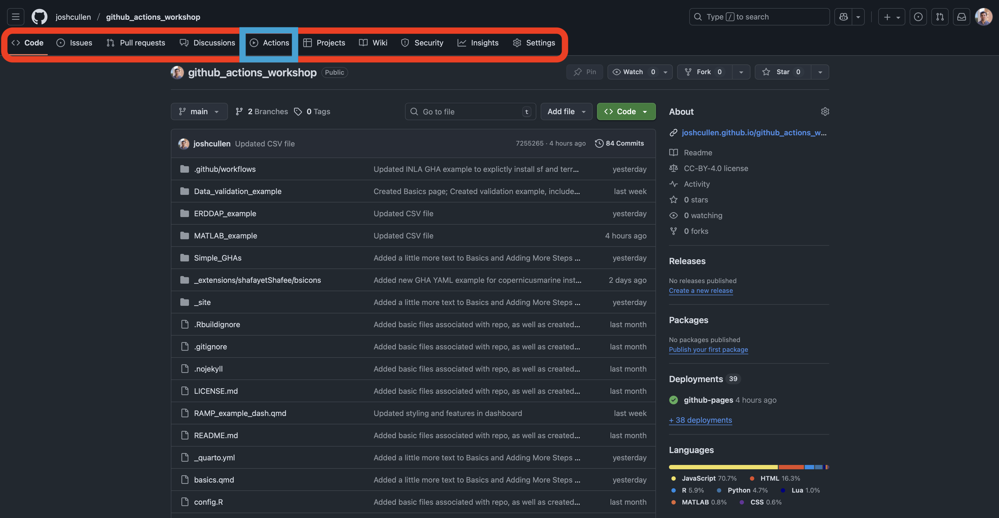
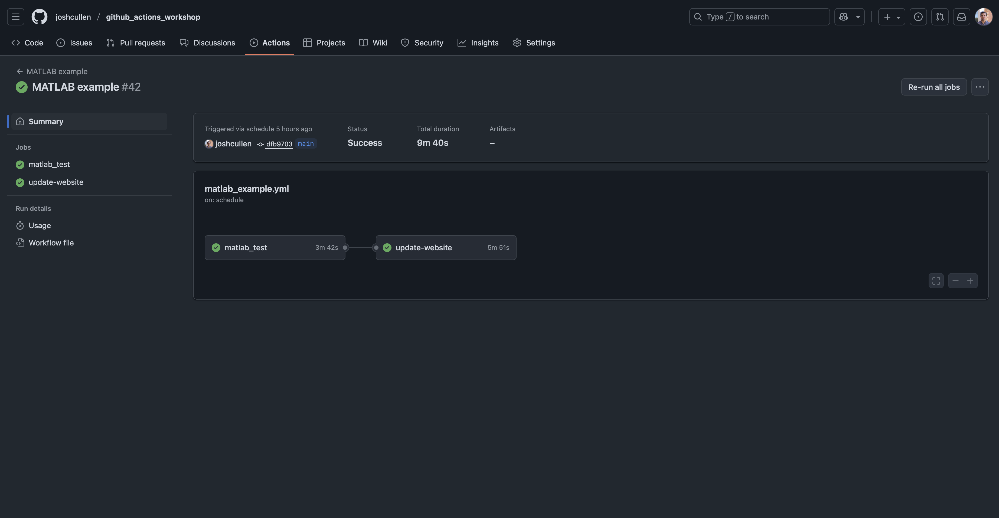
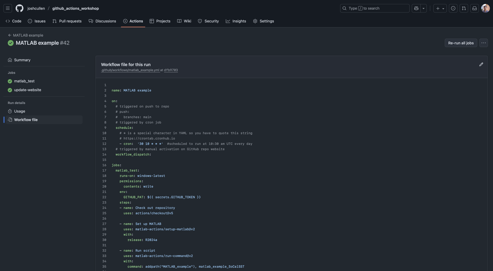
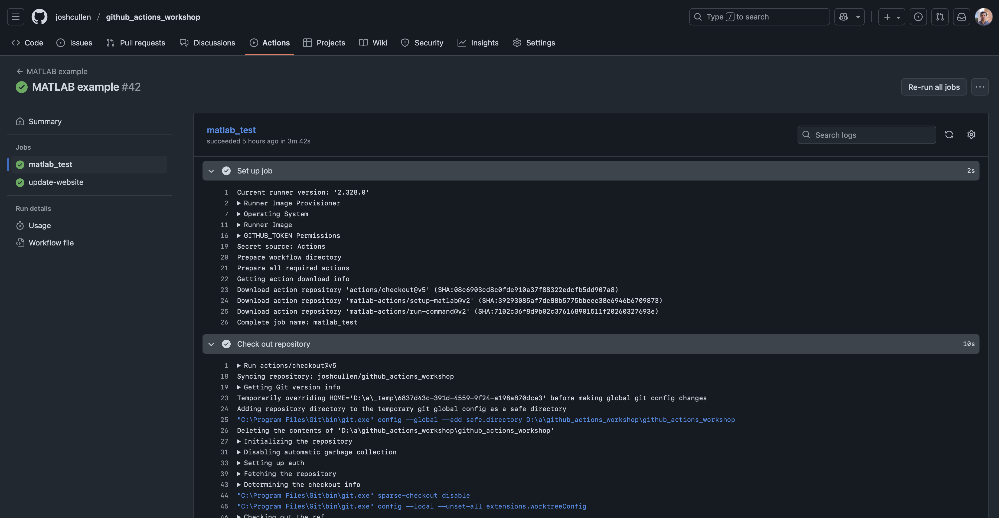
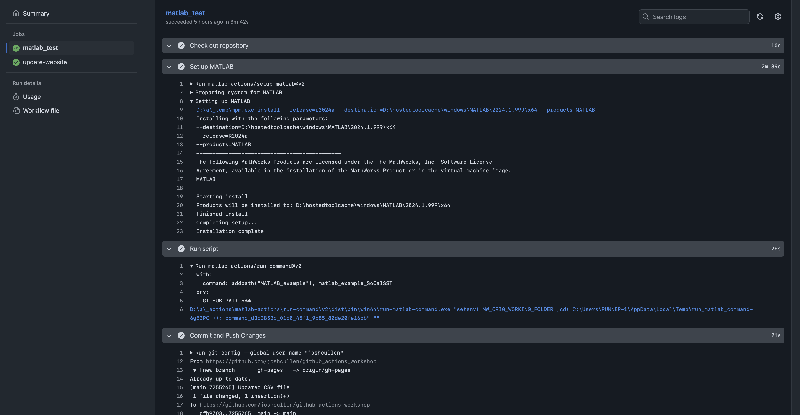

# Getting started {#getting-started}

All of the instructions that dictate the configuration of GitHub Actions are stored within YAML files, where YAML files and syntax are used in a wide variety of applications (*such as for configuring this Quarto website*). These files contain the different elements that were covered on the [Basics](../basics.qmd) page, such as jobs, steps, actions, and events.

Below is a simple YAML that lists all files stored in the GitHub Repository (repo) after pushing a commit to this repo:

::: {.annot-2col}
```{.yaml filename="simple.yml"}
name: Test GHA  # <1>
on: push  # <2>

jobs:  
  test_job:  # <3>
    runs-on: ubuntu-latest  # <4>
    steps:  
    - name: Check out repository  # <5>
      uses: actions/checkout@v5  # <6>

    - name: List files in repo  
      run: ls  # <7>
```

1. (Optional) name provided to the workflow
2. Syntax used for defining which event(s) to use to trigger workflow. Here, we specify that the GitHub Action YAML will be run on `push` to this repo.
3. Custom name given to `job` of workflow. I used `test_job` as the name, but this can be anything (as long as spaces and special characters aren't used).
4. This is where you define the `runner` to use. Unless there's a specific reason to use an earlier version, best practice is to stick with the `-latest` version of the different operating systems.
5. (Optional) name of the first step
6. Example of `uses` syntax for using a pre-made action. In this case, the `checkout` action is selected since this is typically the first step of any workflow. You need to specify the version of the action you'll be using (i.e., `@v5`), of which version 5 is the latest available.
7. Example of `run` syntax for running code directly in the YAML file. In this case, the `ls` command is used to list all files in the root directory of the repo.
:::

<br>
As also mentioned on the [Basics](../basics.qmd) page, these YAML files need to be stored within the `.github/workflows` directory of your repo. If you don't currently have this directory, you'll need to create this manually. And since file paths that begin with a period (`.`) at the beginning are considered hidden files, this may require adjusting settings for your file explorer/finder application, or through use of the terminal.

For example, if the above YAML code was stored in a file named `simple.yml`, then you would run the following command to move this file from your root directory to the correct `.github/workflows` directory:

```bash
mv simple.yml .github/workflows
```

<br>
In subsequent examples, we will build in increasing components and complexity that are more likely to reflect GitHub Actions workflows that are expected to be more useful in tasks for both software development and scientific research.


# Viewing workflows in action

Once you've created your workflow YAML file for GitHub Actions, you'll need to commit and push this file to your `remote` (i.e., the version of your repo that lives in the cloud via the GitHub website). This will then allow the action to be used whenever a triggering event occurs.

The repo should now resemble something like this, where you see the folders and files listed (including the new `.github/workflows` directory with the `simple.yml` file), as well as different tabs above the title of your repo (including the " Actions" tab):

{#fig-gh-repo}

<br>
If we click on this " Actions" tab, you'll see a page that generally looks like this but will essentially be empty if you haven't run any GitHub Actions for this repo:

{#fig-gh-actions-page}

<br>
This page shows your full GitHub Actions history, which can be explored in more detail to examine what's happening in each step and identify where problems may be occurring. On the left side of each workflow, there will be a symbol denoting its status, which can either be a successful completion (), failed run (), or in-progress ().

If we click on one of these recently run workflows, such as "MATLAB example", we can dig in a bit more to see which jobs were run and the output of the different actions and commands we used:

{#fig-gha-workflow-summary}

<br>
Here we see that there were two jobs included in this workflow file, and we can see their status and duration, as well as the relationship between jobs (since this can get quite complex for some workflows). In this case, we see that the "matlab_test" job is on the left side and directly connected to the "update-website" job on the right, indicating that "matlab_test" is run first and then triggers "update-website". We can even take another look at our `simple.yml` workflow file by clicking the corresponding link in the sidebar to double-check what it's doing if the file isn't handy on our computer:

{#fig-gha-workflow-file}

<br>
If we were to click on one of the jobs shown in @fig-gha-workflow-summary, such as "matlab_test", then we can view the logs from this workflow. Additionally, these can inspected as the workflow runs in real-time for active troubleshooting of developing a GitHub Action workflow.

{#fig-gha-log1}

{#fig-gha-log2}

<br>
With this orientation to how GitHub Action workflows are configured via YAML files and how to explore these workflows on the GitHub website, we're ready to start building on top of this by adding more steps to our workflow.