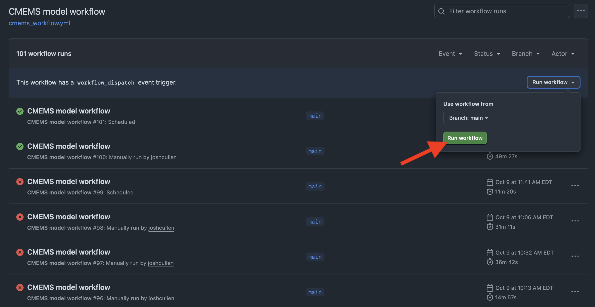

# Background

Now that we've covered how to add different types of `steps` to install software and run shell commands directly in the workflow YAML, we will also want to cover some of the `events` that are likely to be used to trigger scientific workflows. In this section, we'll cover a small subset of `events` that are expected to be relevant, but the full set of `events` can be explored in more detail from the [GitHub documentation](https://docs.github.com/en/actions/reference/workflows-and-actions/events-that-trigger-workflows).

The three main types of `events` that will likely be used most often include:

- `push`
- `schedule`
- `workflow_dispatch`

which represent pushing any changes to your repo (`push`), having a workflow run on a set time interval/time/day (`schedule`), and manual trigger of a GitHub Actions workflow (`workflow_dispatch`) when creating and troubleshooting a workflow.

:::{.callout-note}

However, another option is the use of `workflow_run` to trigger a new workflow after the completion of a different workflow. This can even be configured to run different jobs depending on the **success**  or **failure**  of the preceding workflow.
:::

Below, I will briefly discuss each of these different `events` and provide examples of how they can be used.


# `push`

A `push` event refers to the command `git push` that is used to push files committed from the local repo (i.e., your personal computer or virtual machine in the case of Github Actions) to the remote repo (i.e., the one located in the cloud via GitHub). So if we were to push new CSV files of data, a new fitted model object saved as a file, or updated functions that we changed in an R package we developed, this would trigger the GitHub Action to run for our repo.

As shown for the simple example we covered for the [simple.yml](Anatomy_of_GHA_YAML.qmd#getting-started) workflow, `events` are specified under the `on` argument of the YAML file. However, it should also be noted that multiple `events` can be specified to trigger the same workflow. For example, if we wanted to create a new workflow that was triggered either by a `push` or `pull_request`, we could write that as such:

```{.yaml filename="simple2a.yml"}
name: Push or Pull Request
on: [push, pull_request]  # <1>

jobs:  
  ci_cd:
    runs-on: ubuntu-latest
    steps:  
    - name: Check out repository
      uses: actions/checkout@v5 

    - name: Print directory tree of repo  
      run: tree
```

1. Bracket (`[ ]`) notation can be used to specify multiple events simultaneously


Alternatively, that same file can also be written where each `event` is placed on a new line but at the same indent level:

```{.yaml filename="simple2b.yml"}
name: Push or Pull Request2
on:
  push:  # <1>
  pull_request:

jobs:  
  ci_cd:
    runs-on: ubuntu-latest
    steps:  
    - name: Check out repository
      uses: actions/checkout@v5 

    - name: Print directory tree of repo  
      run: tree
```

1. Alternative format for specifying events, especially if wanting to include additional filters on specific branches, files, etc. **Make sure to end the `event` label with the colon(`:`) syntax, otherwise the workflow will fail.**

<br>
It makes sense to use `push` events when you only want an event to run when you make a change to a file (or set of files), such as when updating a report, dashboard, website, or R package. However, this may not be the best option if you don't want to have to personally commit a change to the repo each time the workflow should run and instead would rather have the workflow run automatically per a set schedule.


# `schedule`

For workflows that are better suited to run over a set time interval (e.g., every 5 min, once a week) or at set times (e.g., 6:30 am every day, 12:00 am Monday-Wednesday-Friday, 2:15 pm the second day of each month), these should be triggered using `schedule`. This powerful `event` type is defined using [POSIX cron syntax](https://pubs.opengroup.org/onlinepubs/9699919799/utilities/crontab.html#tag_20_25_07), which is unfortunately not the easiest to program. However, tools from [Cronhub](https://crontab.cronhub.io) and [Cronitor](https://crontab.guru/every-2-minutes) make creation of these expressions much easier. Some [examples](https://crontab.guru/examples.html) can be found here. Below is an illustration of how these expressions are generated:

```txt
┌───────────── minute (0 - 59)
│ ┌───────────── hour (0 - 23)
│ │ ┌───────────── day of the month (1 - 31)
│ │ │ ┌───────────── month (1 - 12 or JAN-DEC)
│ │ │ │ ┌───────────── day of the week (0 - 6 or SUN-SAT)
│ │ │ │ │
* * * * *
```

:::{.callout-important}
All times specified are in reference to UTC times, so this will require adjusting the time you'd like these workflows to run based on which time zone you live in.

Limitations on how you can specify cron jobs to run scheduled events via GitHub Actions include:

- The shortest intervals that can be run are every 5 minutes
- The non-standard frequency syntax as shown on the [Cronitor](https://crontab.guru/every-2-minutes) site (e.g., `@hourly`, `@daily`) is not available in GitHub Actions
:::

<br>
So for example, this is what the simple GitHub Action workflow would look like if scheduling it to run once an hour:

```{.yaml filename="simple3a.yml"}
name: Hourly workflow
on:
  # triggered by cron job
  schedule:  # <1>
  # * is a special character in YAML, so you have to quote this string
    - cron: '0 * * * *'  # <2>

jobs:  
  ci_cd:
    runs-on: ubuntu-latest
    steps:  
    - name: Check out repository
      uses: actions/checkout@v5 

    - name: Print directory tree of repo  
      run: tree
```
1. Use of `schedule` event to trigger workflow
2. Syntax to denote scheduling of workflow, where cron expression needs to be in quotes unless there are no asterisks (`*`) used

<br>
If instead we wanted this workflow to run every 10 minutes, the cron syntax would look like this:

```yaml
'*/10 * * * *'
```

Alternatively, we could program this workflow to run Monday mornings at 9:15 am Eastern Daylight Time (EDT), which would require the following syntax:

```{.yaml filename="simple3b.yml"}
name: Weekly workflow
on:
  schedule:  
    - cron: '15 13 * * MON' # <1>

jobs:  
  ci_cd:
    runs-on: ubuntu-latest
    steps:  
    - name: Check out repository
      uses: actions/checkout@v5 

    - name: Print directory tree of repo  
      run: tree
```
1. The cron expression for a specific day and time to run this weekly workflow

<br>
Since we want this workflow to run at a specific time for the EDT time zone (which is 4 hours behind UTC; UTC−04:00), we need to set the time to 13:15 (i.e., 1:15 pm) to have this scheduled correctly. For those living in locales where daylight savings time exists, this relationship should be considered when defining which time to schedule workflows to run. For more information on defining settings for `schedule` events, see the [GitHub documentation](https://docs.github.com/en/actions/reference/workflows-and-actions/events-that-trigger-workflows#schedule).


# `workflow_dispatch`

While the use of `push` and `schedule` events will be useful once you have you're workflow YAML file correctly set up, you may also want to have the ability to manually trigger a workflow to either quickly run a job where no changes are needed to the repo or when debugging errors. In these cases, `workflow_dispatch` can be very helpful.

Similar to using `push`, all that is needed is to list the name of the `event` in the workflow YAML. If wanting to include this `event` in addition to a more common one once the workflow file is complete and working, this can be included like in the example below:

```{.yaml filename="simple4a.yml"}
name: Multiple event triggers
on:
  push:
  schedule:  
    - cron: '15 13 * * MON'
  workflow_dispatch:

jobs:  
  ci_cd:
    runs-on: ubuntu-latest
    steps:  
    - name: Check out repository
      uses: actions/checkout@v5 

    - name: Print directory tree of repo  
      run: tree
```

This example file demonstrates how three events (`push`, `schedule`, and `workflow_dispatch`) can all be used together for a single workflow. Once this YAML has been pushed to the `remote`, you will navigate to the " Actions" tab and then click on one of the workflows available from the sidebar, as shown on the [Anatomy of a GitHub Actions YAML page](Anatomy_of_GHA_YAML.qmd#fig-gh-actions-page) (outlined in blue).



**Upon clicking the "Run workflow" button, you'll need to refresh your browser tab before you can see the new workflow that you just triggered.** After doing so, you can then follow along with the *live log* to see where the workflow is failing and try to debug based on the errors received.


# `workflow_run`

Now that we've established some of the main events you're likely to use within a workflow, what if you want to string together multiple workflows? To do this, you'll need to use the `workflow_run` event that allows you to condition the run of another based on the completion of the first. At its simplest, this just requires specifying the name given to the first workflow and specifying the status ("activity type") of this workflow:

```{.yaml filename="simple.yml"}
name: Test GHA
on: push

jobs:  
  test_job:
    runs-on: ubuntu-latest
    steps:  
    - name: Check out repository
      uses: actions/checkout@v5

    - name: List files in repo  
      run: ls
```

::: {.annot-2col}
```{.yaml filename="simple5a.yml"}
name: Trigger workflow on completion of another
on:
  workflow_run:  # <1>
    workflows: [Test GHA]  # <2>
    types:  # <3>
      - completed  # <4>

jobs:  
  print_tree:
    runs-on: ubuntu-latest
    steps:  
    - name: Check out repository
      uses: actions/checkout@v5 

    - name: Print directory tree of repo  
      run: tree
```
1. The name of the `event`
2. Specification of the name given to the previous workflow
3. Argument for the activity type of this `event` (i.e., `completed`, ``requested`, `in_progress`)
4. The activity type selected
:::

<br><br>
With the way these workflows are configured, any push of files to this repo will trigger the `simple.yml` file ("Test GHA") to run, which when completed will then trigger the `simple5a.yml` workflow. There may be cases where we want the `jobs` to differ based on the "successful" or "failed" completion of the previous workflow. This could be configured as such:

```{.yaml filename="simple.yml"}
name: Test GHA
on: push

jobs:  
  test_job:
    runs-on: ubuntu-latest
    steps:  
    - name: Check out repository
      uses: actions/checkout@v5

    - name: List files in repo  
      run: ls
```

::: {.annot-2col}
```{.yaml filename="simple5b.yml"}
name: Conditionally trigger workflow
on:
  workflow_run:
    workflows: [Test GHA]
    types:
      - completed

jobs:
  on-success:  # <1>
    runs-on: ubuntu-latest
    if: ${{ github.event.workflow_run.conclusion == 'success' }}  # <2>
    steps:
      - run: echo 'The triggering workflow passed'
  on-failure:  # <3>
    runs-on: ubuntu-latest
    if: ${{ github.event.workflow_run.conclusion == 'failure' }}  # <4>
    steps:
      - run: echo 'The triggering workflow failed'
```
1. User-specified name given to job indented arguments below (in this case, for 'success' of "Test GHA")
2. Syntax for `if` statement when the previous workflow has successfully completed
3. User-specified name given to job indented arguments below (in this case, for 'failure' of "Test GHA")
4. Syntax for `if` statement when the previous workflow has failed upon completion
:::

<br>
So if the "Test GHA" workflow from `simple.yml` were to succeed, the second workflow in `simple5b.yml` would print out the message "The triggering workflow passed". By comparison, failure of "Test GHA" would result in the printing of "The triggering workflow failed". Although this is a simple example, the `jobs` and nested `steps` could be made to be more complicated for operational pipelines. More information on the use of the `workflow_run` event can be found in the [GitHub documentation](https://docs.github.com/en/actions/reference/workflows-and-actions/events-that-trigger-workflows#workflow_run).

:::{.callout-note}
At maximum, only three workflows can be strung together. Therefore, developers should be mindful of this when deciding when a job should be added to an existing workflow and when it should be used in a separate workflow.
:::


# Takeaways

In this section, we covered how to use four different types of `events` to trigger workflows in GitHub actions based on pushing a commit (`push`), scheduling a workflow (`schedule`), manual triggering of a workflow (`workflow_dispatch`), and using the completion of one workflow as the trigger for another (`workflow_run`). While these four events are expected to be some of the most commonly used for scientific research workflows, others (such as `pull_request`, `issues`) may be more common for CI/CD workflows during software development.

With some of these basics now covered, you now have most of the tools to conduct DevOps (i.e., integration and automation of the software **dev**elopment and IT **op**erations) for your tools, software, and products. In the following sections, we will cover more advanced examples that resemble complete workflows for software development and the operationalization of scientific products.